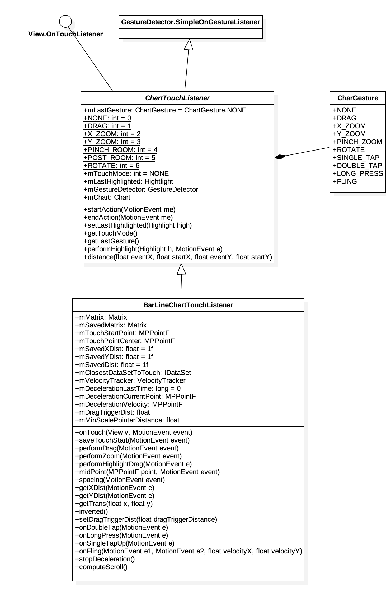

手势处理
---

手势的处理比较简单，没那么多套路。

先来看一张类关系图（以 `BarLineChartTouchListener` 为例）。



`ChartTouchListener` 的枚举类型 `ChartGesture` 定义了所支持的手势类型：

```java
public enum ChartGesture {
  NONE,
  DRAG,
  X_ZOOM,
  Y_ZOOM,
  PINCH_ZOOM,
  ROTATE,
  SINGLE_TAP,
  DOUBLE_TAP,
  LONG_PRESS,
  FLING
}
```

手势处理其实就是一个**状态机模型**，在 `onTouch(View v, MotionEvent event)` 方法中根据**手指个数**或者**移动距离**判断手势类型，然后更新状态。

```java
// 手势状态
protected static final int NONE = 0;
protected static final int DRAG = 1;
protected static final int X_ZOOM = 2;
protected static final int Y_ZOOM = 3;
protected static final int PINCH_ZOOM = 4;
protected static final int POST_ZOOM = 5;
protected static final int ROTATE = 6;

// 默认状态
protected int mTouchMode = NONE;
```

我们首先来看 `DRAG` 的处理方式（省略无关代码，只保留关键代码）：

### 拖动

```java
public boolean onTouch(View v, MotionEvent event) {
  // ...
  switch (event.getAction() & MotionEvent.ACTION_MASK) {
    case MotionEvent.ACTION_DOWN:
      // ...
      saveTouchStart(event);
      break;
    case MotionEvent.ACTION_MOVE:
      if (mTouchMode == NONE && distance(event, mTouchStartPoint) > mDragTriggerDist) {
        mTouchMode = DRAG;
      } else if (mTouchMode == DRAG) {
        performDrag(event);
      }
      break;
    case MotionEvent.ACTION_UP:
      mTouchMode = NONE;
      break;
  }
  mTouchMatrix = mChart.getViewPortHandler().refresh(mTouchMatrix, mChart, true);
}
```

`performDrag` 根据手指的移动距离计算 **DRAG 位移量**，然后更新手势矩阵 `mTouchMatrix`。

```java
private void performDrag(MotionEvent event) {
  dX = event.getX() - mTouchStartPoint.x;
  dY = event.getY() - mTouchStartPoint.y;
  mTouchMatrix.postTranslate(dX, dY);
}
```
然后通过 `ViewPortHandler#refresh` 方法把“修正约束”（`limitTransAndScale`）之后的手势矩阵传给 `ViewPortHandler` 实例。

在 [坐标转换](coordinate-transformations.md) 一节中，我们已经知道 `Transformer#pointValuesToPixel` 方法通过 `mViewPortHandler.getMatrixTouch()` 来获取这个 `mTouchMatrix`。

```java
public Matrix refresh(Matrix newMatrix, View chart, boolean invalidate) {
    mMatrixTouch.set(newMatrix);
    // make sure scale and translation are within their bounds
    limitTransAndScale(mMatrixTouch, mContentRect);
    if (invalidate) chart.invalidate();
    newMatrix.set(mMatrixTouch);
    return newMatrix;
}
```

### 缩放

缩放一共支持三个模式，分别是 `PINCH_ZOOM`、`X_ZOOM`、`Y_ZOOM`。

`onTouch` 方法如果检测到 `ACTION_POINTER_DOWN` 并且有两个手指以上，会根据**两手指间的距离**来判断执行哪一种缩放。

```java
case MotionEvent.ACTION_POINTER_DOWN:
  if (event.getPointerCount() >= 2) {
    mChart.disableScroll();
    saveTouchStart(event);
    // get the distance between the pointers on the x-axis
    mSavedXDist = getXDist(event);
    // get the distance between the pointers on the y-axis
    mSavedYDist = getYDist(event);
    // get the total distance between the pointers
    mSavedDist = spacing(event);
    if (mSavedDist > 10f) {
      if (mChart.isPinchZoomEnabled()) {
        mTouchMode = PINCH_ZOOM;
      } else if (mSavedXDist > mSavedYDist) {
        mTouchMode = X_ZOOM;
      } else {
        mTouchMode = Y_ZOOM;
      }
    }
    // determine the touch-pointer center
    midPoint(mTouchPointCenter, event);
  }
  break;
```

然后在 `ACTION_MOVE` 事件中执行 `performZoom`，更新 `mTouchMatrix`，原理与 DRAG 一样，不再赘述。

以上就是手势处理的部分逻辑，代码不难，具体可见源码。
