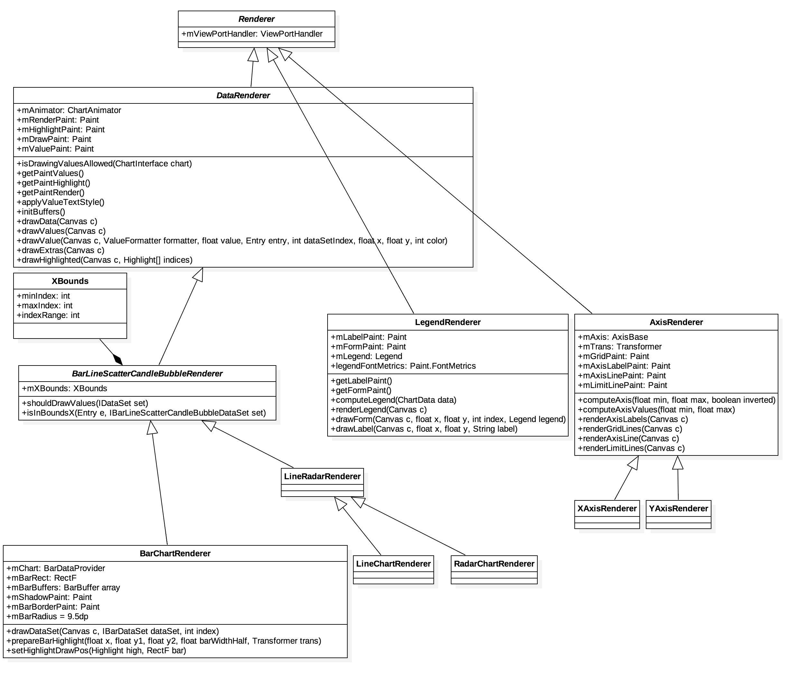
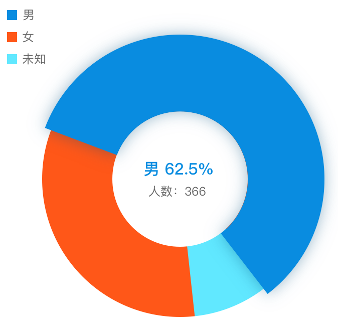

渲染器
---

*类关系图*



由上图可以看出，`Renderer` 是所有渲染器的**基类**，它引用了一个 `ViewPortHandler`：

```java
protected ViewPortHandler mViewPortHandler;
```

`mViewPortHandler` 作为 `Chart` 的可视区域，在 [坐标转换](coordinate-transformations.md)一节已经分析过了，数据的渲染（`DataRenderer` 的子类）必须要在 `ViewPort` 范围内进行。

先来看 `Renderer` 的第一个子类 - `DataRenderer`。

### DataRenderer

`DataRenderer` 有一个动画变量 `mAnimator`，当需要渐进绘制图表时，可以通过 `ChartAnimator` 的两个成员变量来控制进度。

```java
public class ChartAnimator {

  /** the phase that is animated and influences the drawn values on the y-axis */
  protected float mPhaseY = 1f;

  /** the phase that is animated and influences the drawn values on the x-axis */
  protected float mPhaseX = 1f;
}
```

当动画开始时 `mPhaseY` 或 `mPhaseX` 通过 `ObjectAnimator` 从 0 渐变到 1。

*com.github.mikephil.charting.animation.ChartAnimator*
```java
ObjectAnimator animatorY = ObjectAnimator.ofFloat(this, "phaseY", 0f, 1f);
ObjectAnimator animatorX = ObjectAnimator.ofFloat(this, "phaseX", 0f, 1f);
```

这样可以在动画过程中很方便地计算 x y：

```java
float x = entry.getX() * mAnimator.getPhaseX();
float y = entry.getY() * mAnimator.getPhaseY();
```

除了 `mAnimator`，`DataRenderer` 还提供了绘制必须要用到的 `Paint`。

再来看另外一个子类。

### LegendRenderer

*Legend 示例*



在绘制之前要根据 `ChartData` 计算出图表种每一组 `DataSet` 的 `color` 和 `label`。

```java
public void computeLegend(ChartData<?> data);
```

它的调用栈如下所示：

<pre>
LegendRenderer#computeLegend(mData)
              ^
              |
BarLineChartBase#notifyDataSetChanged()
              ^
              |
Chart#setData(T data)
</pre>

`computeLegend` 执行完毕之后会输出 `color` 和 `label` 的数组。

```java
protected List<String> mLabels = new ArrayList<>(16);
protected List<Integer> mColors = new ArrayList<>(16);
```

数据计算完成之后开始渲染。

```java
public void renderLegend(Canvas c);
```

它的调用栈如下：

<pre>
LegendRenderer#renderLegend(canvas);
              ^
              |
BarLineChartBase#onDraw(Canvas canvas)
</pre>
